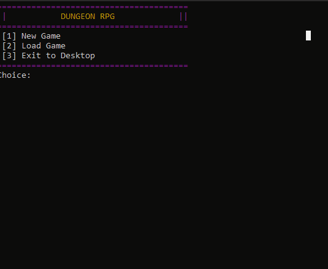

# 🗡️ Terminal Dungeon Crawler


A terminal-based dungeon RPG built from scratch in C++. It was originally a university project but now it's a hobby that I would like to share with others!

This project features a fully functional grid system for the map, RPG mechanics like skills, spells and more, and persistent JSON save states, all rendering directly inside standard console environments.

## 🎮 Gameplay Demo


## ✨ Core Engineering Features
* **Custom OOP Architecture:** Being an OOP project, I went all out in making a complex architecture between different classes, like an entity class tree, an item class tree, a grid related class tree and so on.
* **Data Serialization:** Implements `nlohmann/json` to serialize the dynamic map state and player progression into a local `saves/` directory inside `build/`.
* **Cross-Platform Build:** Configured with a modern CMake build system and native Makefiles for seamless compilation on Windows (via Cygwin/MinGW), Linux, and macOS.

## 🛠️ Build and Run

### Prerequisites
* A C++ compiler supporting C++17 (GCC/Clang)
* CMake (3.15+) and Make

### Compilation (Unix / Cygwin)
Clone the repository and compile using the provided build system:

```bash
git clone https://github.com/skydose/terminal-dungeon-crawler.git
cd terminal-dungeon-crawler
mkdir build && cd build
cmake -G "Unix Makefiles" ..
make
./DungeonRPG.exe  # Or ./DungeonRPG on Linux/Mac
